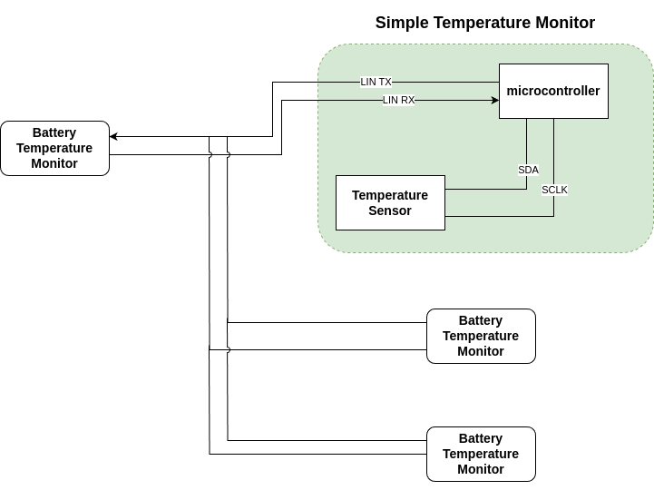
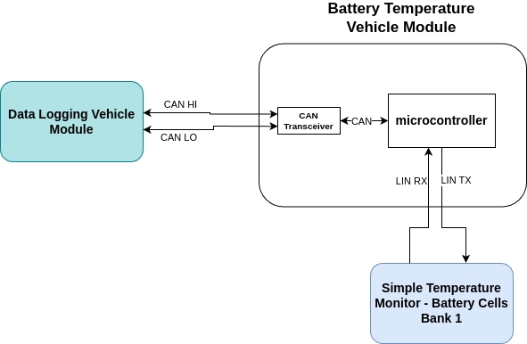
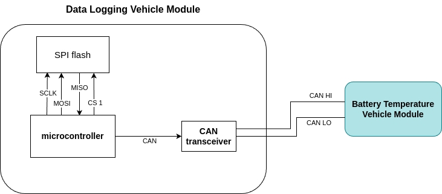
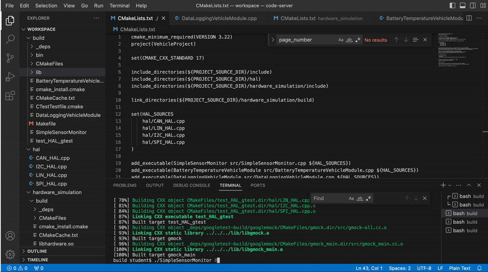

# Simple Vehicle Communication Project 

Create 3 different vehicle modules to represent communication in vehicle
1. SimpleTemperatureMonitor
    - Read the Temperature value over i2c.
    - Responds to LIN frames with the Avg temperature or current temperature.
       
       
2. BatteryTemperatureVehicleModule
    - Sends Temperature requests to the SimpleTemperatureMonitor over LIN.
    - Responds to CAN RTR frames the for the current temp, avg temp, and current time in seconds.

       
3. DataLoggingVehicleModule
    - Sends CAN RTR frames to the BatteryTemperatureVehicleModule.
    - Reads the CAN Data frames with the current temp, avg temp, and time stamp.
    - Saves the data to the SPI Flash on chip select 1.

      
## Getting Started

To build this within the workspace
``` 
mkdir build && cd build
cmake ..
make
```
Run the executable with:
```
./SimpleSensorMonitor 0
./BatteryTemperatureVehicleModule 1
./DataLoggingVehicleModule 2
```

### Dependencies

CMake

## Testing

To run the tests, you can use the following command:
```
./test_HAL_gtest 
```

## Software Design Pattern

In this project, we utilize the `Hardware Abstraction Layer (HAL)` design pattern to separate hardware-specific implementations (registers, drivers, protocols) from the application logic which enables to run on a different device or adding new hardware or features, we only need to update the HAL implementation not the core logic. This allows for easier reading, testing, maintain and simulation of the vehicle modules without needing actual hardware with the following steps:

- Define abstract interfaces for each communication protocol (CAN, I2C, LIN, SPI).
- Implement these interfaces for each supported platform/devices.

- Use the interfaces in the application logic, not direct hardware calls.  

By using the `singleton pattern` for the CANBus interface to ensures only one CAN bus instance exists in the process, all parts of our code interact with the same CAN bus object, such that filters, callbacks, and configuration are always in sync. Preventing conflicts or duplicated state or multiple objects from trying to bind to the same hardware or network port. Promote thread safety by centralizing access, making it easier to manage concurrency and synchronization.

## Project Structure

- `hal/` for hardware abstraction implementations
- `include/` for interfaces and config
- `src/` for application logic
- `hardware_simulation/` for simulation code
- `test/` for unit tests using Google Test framework

```
project-root/
│
├── include/
│   ├── CAN_HAL.h
│   ├── I2C_HAL.h
│   ├── LIN_HAL.h
│   ├── SPI_HAL.h
│   └── config.h
│
├── hal/
│   ├── CAN_HAL.cpp
│   ├── I2C_HAL.cpp
│   ├── SPI_HAL.cpp
│   └── LIN_HAL.cpp
│
├── src/
│   ├── BatteryTemperatureVehicleModule.cpp
│   ├── DataLoggingVehicleModule.cpp
│   └── SimpleSensorMonitor.cpp
│
├── hardware_simulation/
│   └── ... (existing simulation code)
│
├── test/
│   └── test_HAL_gtest.cpp
│
└── CMakeLists.txt
```
## Demonstration  
  

## License
[License](../LICENSE.md)
